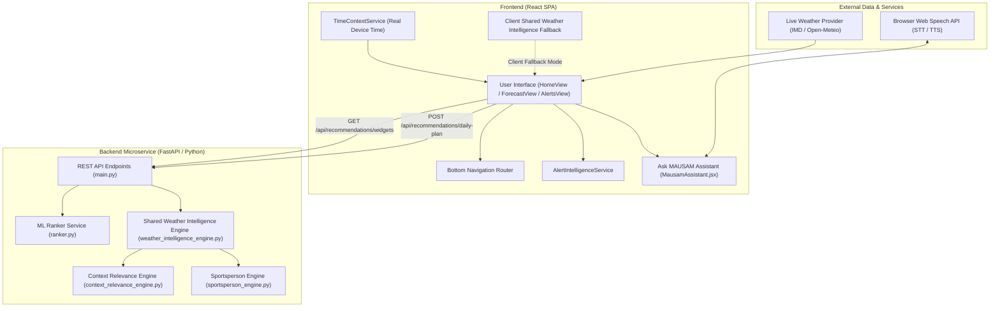
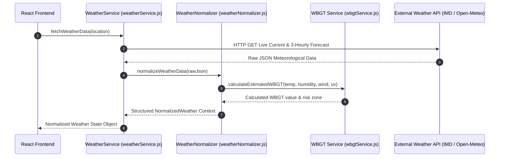
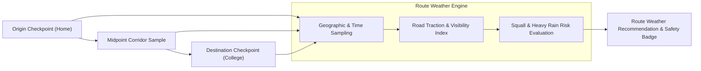
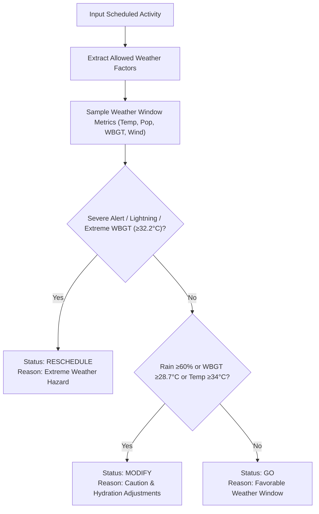
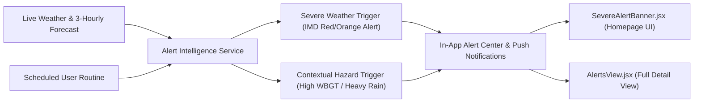
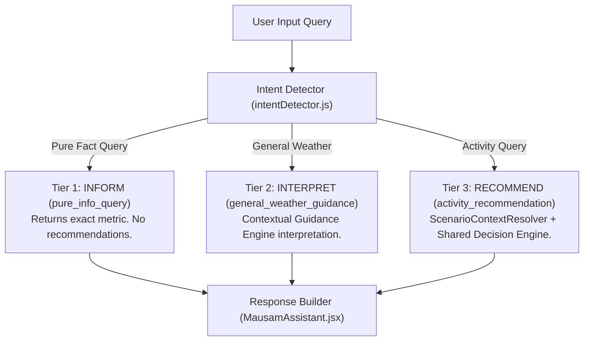
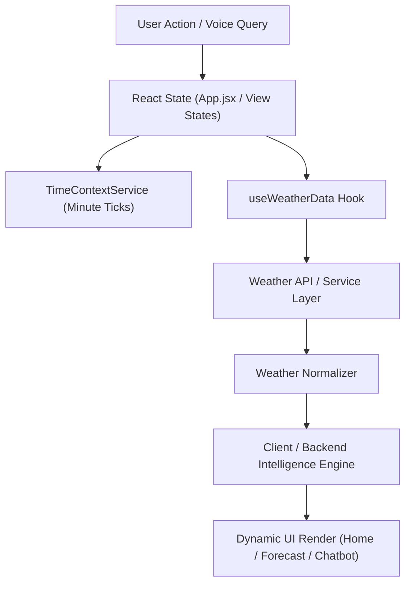
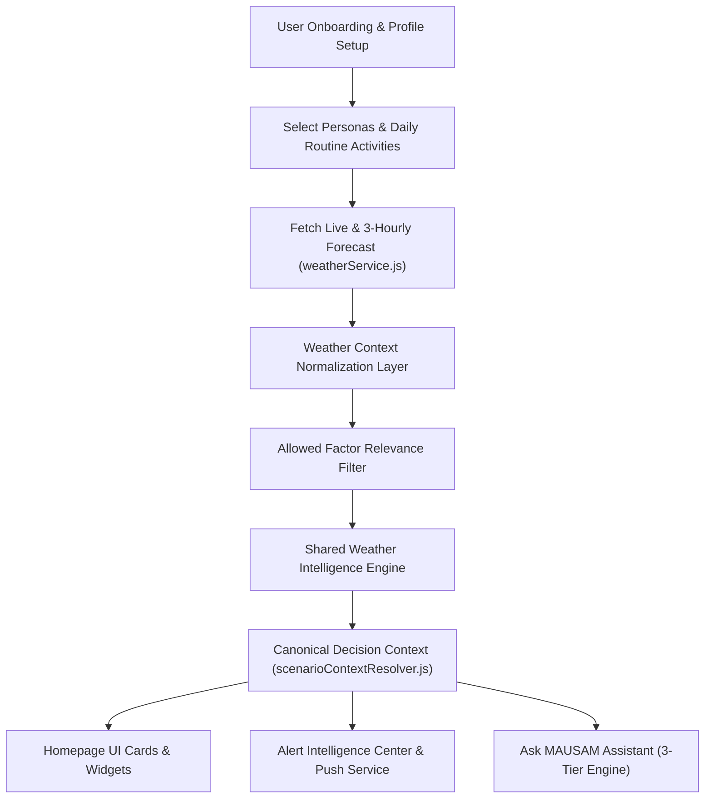

# MAUSAM — Comprehensive Project Technical Documentation

Master Technical Reference & System Architecture Specification  
**Project Repository**: `MAUSAM` (Personalized Weather Intelligence Platform)  
**Document Status**: Production / Verified Implementation Reference  
**Last Updated**: September 4, 2026  

---

## Table of Contents

1. [Project Overview](#1-project-overview)
2. [Problem Statement](#2-problem-statement)
3. [Proposed Solution](#3-proposed-solution)
4. [Complete Technology Stack](#4-complete-technology-stack)
5. [Project Folder Structure](#5-project-folder-structure)
6. [System Architecture](#6-system-architecture)
7. [User Personalization Architecture](#7-user-personalization-architecture)
8. [Persona Intelligence System](#8-persona-intelligence-system)
9. [Weather Data Architecture](#9-weather-data-architecture)
10. [Real-Time Weather System](#10-real-time-weather-system)
11. [Activity Management System](#11-activity-management-system)
12. [Activity-to-Weather Relevance Engine](#12-activity-to-weather-relevance-engine)
13. [Route-Based Weather Intelligence](#13-route-based-weather-intelligence)
14. [Persona Prioritized Widgets](#14-persona-prioritized-widgets)
15. [Widget Relevance Ranking & Machine Learning](#15-widget-relevance-ranking--machine-learning)
16. [Recommendation Engine](#16-recommendation-engine)
17. [Time-Aware Recommendation Logic](#17-time-aware-recommendation-logic)
18. [WBGT and Physical Activity Intelligence](#18-wbgt-and-physical-activity-intelligence)
19. [Sportsperson Intelligence](#19-sportsperson-intelligence)
20. [Alert & Notification System](#20-alert--notification-system)
21. [Chatbot Architecture — Ask MAUSAM](#21-chatbot-architecture--ask-mausam)
22. [Shared Decision Context & Data Consistency](#22-shared-decision-context--data-consistency)
23. [Current Weather vs Recommendation Data Separation](#23-current-weather-vs-recommendation-data-separation)
24. [API Documentation](#24-api-documentation)
25. [Data Models & Schemas](#25-data-models--schemas)
26. [State Management & Data Flow](#26-state-management--data-flow)
27. [Error Handling & Fallback Systems](#27-error-handling--fallback-systems)
28. [Security & Privacy](#28-security--privacy)
29. [Testing Suite](#29-testing-suite)
30. [Key Algorithms & Decision Logic](#30-key-algorithms--decision-logic)
31. [Key Features Matrix](#31-key-features-matrix)
32. [Innovation & Differentiators](#32-innovation--differentiators)
33. [Current Limitations](#33-current-limitations)
34. [Future Scope](#34-future-scope)
35. [Complete End-to-End Data Flow](#35-complete-end-to-end-data-flow)
36. [How to Run the Project](#36-how-to-run-the-project)
37. [Code References](#37-code-references)
38. [Documentation Analysis Summary](#38-documentation-analysis-summary)

---

## 1. Project Overview

**MAUSAM** (Personalized Weather Intelligence Platform) is an advanced, persona-driven weather decision engine designed to bridge the gap between raw meteorological data and human activity decisions. 

Standard weather applications display uninterpreted figures (e.g. `31°C`, `78% humidity`, `12 km/h wind`), forcing users to manually calculate physical strain, rain risks, or travel safety. **MAUSAM** replaces generic data views with **context-aware weather intelligence**. It ingests live weather observations, forecast models, user profiles, persona roles, and daily routines to deliver deterministic activity recommendations (`GO`, `MODIFY`, or `RESCHEDULE`), interactive widgets, proactive alerts, and an intelligent conversational assistant.

### Key Differentiators
- **Persona-Specific Intelligence**: Tailored evaluation logic for 9 distinct personas (Sportsperson, Fitness, Health-Conscious, Commuter, Parent, Event Planner, Agriculture, Traveler, Daily Life).
- **Single Source of Decision Truth**: Shared decision context (`evaluateSharedWeatherIntelligence`) ensuring 100% alignment across Homepage UI cards, Recommendations, Alert Intelligence, and the Conversational Assistant.
- **Activity-Aware Relevance Gating**: Prevents irrelevant factors (e.g., WBGT heat stress for travel or indoor study) from corrupting decision recommendations.
- **3-Tier Conversational Assistant**: Distinguishes pure weather facts (*Inform*), physical comfort interpretation (*Interpret*), and activity recommendations (*Recommend*).
- **Dual ML + Rule-Based Ranking**: Employs Scikit-Learn `GradientBoostingClassifier` for engagement-based widget prioritization with robust rule-based fallback for cold-start users.

---

## 2. Problem Statement

Conventional weather services suffer from key limitations:

1. **Information Overload Without Context**: Users are presented with dense graphs and tables without clear guidance on how weather impacts specific activities (e.g., whether `30°C` with `85% humidity` is safe for intense football training).
2. **One-Size-Fits-All Metrics**: A single temperature or rain percentage is presented identically to an athlete, a commuter, a parent sending children to school, or a farmer managing crop irrigation.
3. **Lack of Activity Timing Alignment**: Recommendations are often calculated against daily average temperatures rather than the user's *exact scheduled activity window* (e.g., 5:00 PM – 7:30 PM).
4. **Assistant Hallucinations & Contradictions**: Conversational AI tools frequently give conflicting advice (e.g., telling an athlete to "stick to routine" when the weather engine marked that routine as unsafe due to severe heat stress).

MAUSAM solves these challenges by combining deterministic meteorological rules, machine learning widget ranking, and strict decision consistency guards.

---

## 3. Proposed Solution

MAUSAM implements an end-to-end contextual intelligence pipeline:

```
┌────────────────────────┐
│   Raw Weather Data     │ (IMD / Open-Meteo Live & Forecast)
└───────────┬────────────┘
            │
┌───────────▼────────────┐
│ Weather Normalization  │ (Null-Safe Metric Resolution)
└───────────┬────────────┘
            │
┌───────────▼────────────┐
│   User & Persona       │ (9 Personas, Routine Activities, Locations)
└───────────┬────────────┘
            │
┌───────────▼────────────┐
│ Relevance Gate         │ (Allowed Factor Filtering per Activity Type)
└───────────┬────────────┘
            │
┌───────────▼────────────┐
│ Shared Decision Engine │ (evaluateSharedWeatherIntelligence)
└───────────┬────────────┘
            │
 ┌──────────┴────────────────────────┬──────────────────────────┐
 │                                   │                          │
 ▼                                   ▼                          ▼
┌────────────────────────┐ ┌───────────────────┐ ┌────────────────────────┐
│  Homepage UI Cards &   │ │ Alert Intelligence│ │ Conversational Assistant│
│  Prioritized Widgets   │ │  & Notifications  │ │    (Ask MAUSAM)        │
└────────────────────────┘ └───────────────────┘ └────────────────────────┘
```

---

## 4. Complete Technology Stack

| Layer | Technology | Version / Spec | Purpose in MAUSAM |
| :--- | :--- | :--- | :--- |
| **Frontend Framework** | React | `18.3.1` | Declarative UI rendering, component hierarchy, hooks state management |
| **Build Tool & Server** | Vite | `6.0.7` | High-performance ES module bundler & dev server |
| **Styling & Design System** | Vanilla CSS + TailwindCSS | `3.4.17` | Responsive mobile-first design, color tokens, dynamic animations |
| **UI Utilities** | `clsx`, `tailwind-merge` | `2.1.1` / `2.6.0` | Conditional class merging and dynamic styling utilities |
| **Icons Library** | Lucide React | `0.475.0` | Iconography across navigation, widgets, weather metrics, and cards |
| **Internationalization** | Custom Context (`i18nContext.jsx`) | Multi-lingual | Full English (`en`) and Hindi (`hi-IN`) translations & speech support |
| **Speech-to-Text (STT)** | Web Speech API | Native Browser | Voice query input for Ask MAUSAM assistant |
| **Text-to-Speech (TTS)** | SpeechSynthesis API | Native Browser | Audio read-aloud for assistant recommendations (`voiceService.js`) |
| **Backend Framework** | FastAPI (Python) | `2.0.0` / Python `3.12` | Asynchronous REST API microservice (`backend/main.py`) |
| **Validation & Schema** | Pydantic | `v2` | Strict data request/response validation (`backend/models.py`) |
| **Machine Learning** | Scikit-Learn | `scikit-learn` | `GradientBoostingClassifier` for engagement-driven widget ranking (`backend/ranker.py`) |
| **Data Processing** | NumPy | `1.26+` | Feature array transformations and scoring vector calculations |
| **Test Framework** | Pytest | `9.1.1` | Automated test suite for backend decision rules (`backend/test_recommendations.py`) |
| **Data Persistence** | Client Storage / In-Memory Models | `localStorage` | Preserves persona selection, custom locations, routine settings, and session profile |

---

## 5. Project Folder Structure

```
Mausam/
├── docs/                                 # Central Technical Documentation
│   └── MAUSAM_PROJECT_DOCUMENTATION.md   # Master Technical Reference
├── backend/                              # FastAPI Microservice & Python Decision Engines
│   ├── main.py                           # REST API routes (/health, /api/recommendations/widgets, /api/recommendations/daily-plan)
│   ├── models.py                         # Pydantic schemas (WeatherDataInput, DailyPlanRequest, DailyPlanResponse, etc.)
│   ├── ranker.py                         # GradientBoostingClassifier ML Ranker & Rule-based Cold-Start Fallback
│   ├── weather_intelligence_engine.py    # Primary Decision Intelligence & Shared Weather Intelligence Engine
│   ├── context_relevance_engine.py       # Activity-to-Weather factor relevance gating & persona matrices
│   ├── sportsperson_engine.py            # Sportsperson decision logic (WBGT, turf traction, rain thresholds)
│   ├── daily_engine.py                   # Daily activity plan recommendation rules
│   ├── mock_db.py                        # Default routine, location, and persona preset data store
│   └── test_recommendations.py           # 34 automated unit & integration tests
├── src/                                  # React Frontend Application
│   ├── App.jsx                           # Main application orchestrator & layout container
│   ├── main.jsx                          # React DOM entry point
│   ├── index.css                         # Global CSS & Tailwind imports
│   ├── auth/                             # Authentication & User ID Setup screens
│   │   ├── WelcomeScreen.jsx, Login.jsx, Signup.jsx, CreateUserId.jsx, OTPVerification.jsx, authService.js
│   ├── onboarding/                       # User Onboarding & Persona Setup flow
│   │   ├── LanguageSelection.jsx, PersonalizationIntro.jsx, LocationSetup.jsx, RoutineSetup.jsx, PreferenceQuestions.jsx, PersonalizationComplete.jsx
│   ├── chatbot/                          # Ask MAUSAM Assistant System
│   │   ├── MausamAssistant.jsx           # Assistant Modal UI & Speech controls
│   │   ├── chatbotEngine.js              # 3-Tier Multi-route Assistant Router
│   │   ├── intentDetector.js             # Multi-lingual intent classifier (Inform, Interpret, Recommend)
│   │   ├── normalizedWeatherContext.js   # Null-safe weather metric normalization layer
│   │   ├── chatbotContext.js             # Assistant context builder
│   │   ├── voiceService.js               # Browser Speech STT/TTS service wrapper
│   │   └── engines/                      # Persona chatbot sub-engines (sportspersonEngine.js)
│   ├── engine/                           # Client-Side Fallback Decision Engines
│   │   ├── sharedWeatherIntelligence.js  # Client-side mirror of Shared Weather Intelligence Engine
│   │   ├── scenarioContextResolver.js    # Composite scenario ID resolver & Single Source of Decision Truth
│   │   ├── decisionConsistencyValidator.js # Cross-system decision validator & TimeContextValidator
│   │   ├── routeWeatherEngine.js         # Route & corridor weather analysis engine
│   │   ├── contextRelevanceEngine.js     # Client-side factor relevance matrix & allowed factor gating
│   │   ├── relevanceScoreCalculator.js   # Client-side widget score calculator
│   │   ├── weatherToActionEngine.js      # Weather-to-action threshold rules
│   │   ├── briefingEngine.js             # Daily briefing summary generator
│   │   ├── personaRegistry.js            # Persona profiles & default widget priorities
│   │   └── personaDerivationEngine.js    # Auto-derives personas from user routine activities
│   ├── services/                         # Core Business Services
│   │   ├── weatherService.js             # Live weather & 3-hourly forecast API provider (IMD/Open-Meteo)
│   │   ├── weatherNormalizer.js          # API response transformer & unit normalizer
│   │   ├── timeContextService.js         # Authoritative real device time manager
│   │   ├── wbgtService.js                # BOM/Liljegren WBGT thermal strain calculator
│   │   ├── alertIntelligenceService.js   # Proactive alert detection & notification engine
│   │   ├── locationService.js            # Geocoding & preset locations store
│   │   ├── recommendationService.js     # REST API client for backend engine calls
│   │   └── pushNotificationService.js    # In-app push notification trigger service
│   ├── components/                       # UI Component Library
│   │   ├── views/                        # Core Application Views (HomeView, ForecastView, AlertsView, LocationsView, RadarMapView)
│   │   ├── common/                       # Shared Components (Header, BottomNav, WidgetCard, PersonaChipRow, SideDrawer, DemoControlBar, SevereAlertBanner)
│   │   ├── recommendations/              # Recommendation UI (DailyPlanCard, RecommendationDetailModal, CoachViewCard)
│   │   └── routine/                      # Routine UI (ActivityTimeline, RouteWeatherDetailModal, RoutineEditorModal)
│   ├── data/                             # Default Preset Stores (locationsData.js, personaDefinitions.js, presetProfiles.js, routineData.js, customLocationStore.js)
│   ├── hooks/                            # Custom React Hooks (useTimeContext.js, useWeatherData.js, useLocationSearch.js)
│   ├── i18n/                             # Localization Context & Translations (i18nContext.jsx, translations.js)
│   └── utils/                            # Time & Data Utility Functions (timeUtils.js)
├── package.json                          # Node dependencies & build scripts
├── vite.config.js                        # Vite build configuration
└── tailwind.config.js                    # Tailwind styling configuration
```

---

## 6. System Architecture

MAUSAM employs a decoupled client-server architecture. The frontend functions as a rich, single-page application (SPA) capable of running client-side decision fallbacks while seamlessly connecting to the FastAPI Python backend for ML widget ranking and recommendations.



---

## 7. User Personalization Architecture

User personalization in MAUSAM is structured around a composite profile object combining explicit user selections, daily routines, custom locations, and derived personas.

### Profile Structure (`src/data/presetProfiles.js`)
- **User Profile**: User ID, contact email/phone, preferred language (`en`/`hi`), experience level (`beginner`, `intermediate`, `advanced`), and risk tolerance (`conservative`, `balanced`, `aggressive`).
- **Selected Personas**: An array of active persona IDs selected by the user (e.g. `['sportsperson', 'commuter']`).
- **Routine Activities**: Scheduled daily weather routine items, including start time, end time, location, activity type, flexibility, and active days.
- **Locations Store**: Saved primary, work, sports ground, and travel corridor locations with latitude/longitude coordinates.

### Personalization Data Flow
1. **Onboarding Flow**: Handled by `src/onboarding/`, allowing users to select language, set default location, define routine activities, and select primary personas.
2. **Dynamic Persona Derivation**: `src/engine/personaDerivationEngine.js` inspects routine activity types (e.g., detecting `running` activities automatically enables `sportsperson` / `fitness` persona relevance).
3. **Context Construction**: `src/chatbot/chatbotContext.js` and `src/engine/scenarioContextResolver.js` build composite context objects incorporating persona priorities for downstream evaluation.

---

## 8. Persona Intelligence System

MAUSAM supports **9 fully defined personas**, each governed by specific widget weights, factor relevance matrices, and recommendation rules:

| Persona ID | Display Name | Primary Focus & Target Metrics | Key Prioritized Widgets |
| :--- | :--- | :--- | :--- |
| `sportsperson` | Sportsperson | Thermal heat strain (WBGT), turf traction, dew, lightning risk, wind gauge | `wbgt_tracker`, `hydration_guide`, `rain_radar`, `uv_forecast` |
| `fitness` | Outdoor Fitness | Exercise comfort index, outdoor AQI, UV heat index, workout suitability | `uv_forecast`, `hydration_guide`, `aqi_health`, `wbgt_tracker` |
| `health_conscious` | Health Conscious | Air Quality Index (AQI), UV protection, humidity health impact, allergen context | `aqi_health`, `uv_forecast`, `hydration_guide` |
| `commuter` | Daily Commuter | Road surface traction, visibility/fog, two-wheeler squall risk, travel corridor | `transit_corridor`, `rain_radar`, `aqi_health` |
| `parent` | Parent & Family | School transit window weather, child thermal safety, clothing advisory | `parent_routine`, `aqi_health`, `rain_radar` |
| `event_planner` | Event Planner | Outdoor event suitability, wind exposure, precipitation contingency planning | `event_planner`, `rain_radar`, `uv_forecast` |
| `agriculture` | Agriculture & Farmer | Agronomic soil moisture, crop pathogen risk, evapotranspiration, irrigation | `soil_moisture`, `crop_disease`, `rain_radar` |
| `traveler` | Traveler | Regional destination weather, corridor storm alerts, packing checklist | `travel_weather`, `rain_radar`, `uv_forecast` |
| `daily_life` | Daily Routine (Default) | Balanced everyday forecast, ambient temp, rain risk, general comfort | `aqi_health`, `uv_forecast`, `rain_radar` |

### Multi-Persona Selection & Homepage Filtering
The homepage chip row (`PersonaChipRow.jsx`) allows selecting multiple active personas. When multiple personas are active, widget ranking aggregates weights across selected personas, while the recommendation engine evaluates rules against the primary selected persona.

---

## 9. Weather Data Architecture

The weather data architecture ingests raw meteorological data, normalizes unit representations, and constructs standardized application weather context objects.



### Data Normalization Pipeline (`weatherNormalizer.js`)
Raw API responses are transformed into standard units:
- **Temperature**: Celsius (`°C`)
- **Humidity**: Relative Humidity percentage (`%`)
- **Wind Speed**: Kilometers per hour (`km/h`) and wind direction (`N`, `NE`, `SSW`, etc.)
- **Precipitation**: Rain probability percentage (`0–100%`) and 24h accumulated rainfall (`mm`)
- **Air Quality**: AQI index value (`0–500`) and AQI health status (`Good`, `Satisfactory`, `Moderate`, `Poor`, `Severe`)
- **WBGT**: Calculated Wet-Bulb Globe Temperature (`°C`) and thermal strain zone (`low`, `moderate`, `high`, `extreme`)

---

## 10. Real-Time Weather System

MAUSAM strictly enforces the architectural separation of **3 distinct time concepts** (`timeContextService.js`):

1. **CURRENT TIME (Real Device Time)**: Derived dynamically from the user's actual system clock (`new Date()`). Updated minute-by-minute and refreshed on window focus. **NEVER** overwritten by activity start times or user selections.
2. **SCHEDULED TIME**: Activity-specific selected times (e.g. `17:00` for an evening run). Evaluated against future forecast arrays.
3. **QUERY TIME**: Local reference timestamps extracted from conversational assistant queries (e.g. *"at 6 PM"*).

### Data Type Separation
- **LIVE CURRENT WEATHER**: Consumed by current condition hero cards, live widgets, and `CURRENT_WEATHER` assistant queries.
- **FUTURE PREDICTIVE FORECAST**: Consumed by daily routine recommendations, future activity cards, and `FORECAST` assistant queries.

---

## 11. Activity Management System

The Daily Weather Routine system manages scheduled activities (`src/data/routineData.js` and `RoutineEditorModal.jsx`).

### Activity Schema
- `id`: Unique activity identifier (e.g. `act-running-1`)
- `label`: Human-readable title (e.g. `Evening Running Session`)
- `type`: Activity classification (`sports`, `running`, `commute`, `college`, `office`, `farm_work`, `indoor`)
- `startTime`: 24-hour start time string (`HH:MM`, e.g. `17:00`)
- `endTime`: 24-hour end time string (`HH:MM`, e.g. `19:30`)
- `location`: Associated location name or corridor
- `flexible`: Boolean indicating if activity window can be shifted if weather is unfavorable
- `days`: Active recurrence array (e.g. `[1, 2, 3, 4, 5]` for weekdays)

---

## 12. Activity-to-Weather Relevance Engine

The Relevance Engine (`src/engine/contextRelevanceEngine.js` & `backend/context_relevance_engine.py`) enforces **Allowed Factor Selection**. Not every weather metric influences every activity type:

| Activity Type | Allowed Weather Factors | Explicitly Excluded Factors |
| :--- | :--- | :--- |
| `running` / `sports` | Temperature, WBGT, Humidity, Rain Probability, Wind Speed, Lightning Risk, Turf Traction | Soil Moisture, Evapotranspiration |
| `commute` / `travel` | Rain Probability, Wind Speed, Visibility, Storm Risk, Road Traction | WBGT, Soil Moisture, UV Index |
| `indoor` / `study` | Temperature, AQI, Severe Weather Warning (Shelter) | WBGT, Wind Speed, Turf Traction, Soil Moisture |
| `farm_work` | Soil Moisture, Evapotranspiration, Rain, Temperature, Humidity, Wind | WBGT, Turf Traction |

### Allowed Factor Gate Rule
If a weather factor is not present in `allowedFactors` for that activity type, **it cannot trigger a RESCHEDULE or MODIFY decision**, even if that factor reaches critical levels globally. For example, extreme WBGT does *not* reschedule an indoor study activity.

---

## 13. Route-Based Weather Intelligence

Route-based activities (e.g. commuting to college or traveling between corridors) are evaluated by `routeWeatherEngine.js`.



### Corridor Sampling Logic
- Samples origin, midpoint, and destination coordinates along the transit corridor.
- Computes estimated arrival timestamps based on start time and transit duration.
- Evaluates road surface traction (`Dry & Clear`, `Wet & Slick`, `Waterlogged`) and two-wheeler squall risk.

---

## 14. Persona Prioritized Widgets

The homepage widget grid (`HomeView.jsx` & `WidgetCard.jsx`) displays persona-prioritized cards:

### Supported Widgets
1. `wbgt_tracker` (WBGT Heat Stress Index & Zone Gauge)
2. `uv_forecast` (UV Index & Solar Protection Guidance)
3. `aqi_health` (Air Quality Index & Respiratory Advisory)
4. `rain_radar` (Precipitation Probability & Doppler Trend)
5. `soil_moisture` (Agronomic Evapotranspiration & Moisture)
6. `crop_disease` (Crop Fungal & Pathogen Risk Index)
7. `transit_corridor` (Commute Road Grip & Visibility)
8. `event_planner` (Outdoor Event Wind & Comfort Index)
9. `parent_routine` (Child School Transit Thermal Guidance)
10. `travel_weather` (Destination Regional Forecast)
11. `hydration_guide` (Fluid & Electrolyte Loss Estimator)

---

## 15. Widget Relevance Ranking & Machine Learning

Widget grid ordering is powered by a **Hybrid Machine Learning + Rule-Based System** (`backend/ranker.py`):

### Scikit-Learn Model Architecture
- **Algorithm**: `GradientBoostingClassifier` (`n_estimators=20`, `random_state=42`).
- **Input Feature Vector**:
  1. `persona_hash % 10` (Normalized persona identifier)
  2. `temp_c / 5.0` (Normalized ambient temperature)
  3. `humidity_pct / 10.0` (Normalized relative humidity)
  4. `rain_probability * 10.0` (Precipitation probability)
  5. `prior_engagement_clicks` (User click count for widget)
- **Model Output**: Predicted probability score (`0.0 to 1.0`), combined with engagement boost (`clicks * 0.12`).

### Rule-Based Cold-Start Fallback
If user engagement history is empty (0 total clicks), `ranker.py` automatically sets `is_fallback: true` and applies persona default ordering tables (`PERSONA_DEFAULT_RANKINGS`).

---

## 16. Recommendation Engine

The Recommendation Engine (`sharedWeatherIntelligence.js` & `backend/weather_intelligence_engine.py`) produces structured activity decisions:



### Recommendation Status Definitions
- `GO`: Weather conditions are fully favorable for the activity.
- `MODIFY`: Favorable with minor adjustments (e.g. carry extra water, reduce exertion, wear wet-weather gear).
- `RESCHEDULE`: Unfavorable conditions exceeding safety thresholds. Includes an alternative recommended time window (e.g. *"Reschedule session to 07:00 AM"*).

---

## 17. Time-Aware Recommendation Logic

Recommendations sample weather forecast arrays based on **exact scheduled activity time windows** (`getActivityWeatherWindow`):

- **Active Occurrence**: If real device time falls within the activity start and end time (e.g., current time `17:30` for activity `17:00–19:30`), status is marked `Currently Active`.
- **Passed Occurrence**: If current device time is past the end time (e.g., current time `20:00` for activity `17:00–19:30`), `resolveNextActivityOccurrence` advances evaluation to **Tomorrow's occurrence date**.

---

## 18. WBGT and Physical Activity Intelligence

Wet-Bulb Globe Temperature (WBGT) measures environmental heat stress on the human body (`wbgtService.js`):

### Formula (BOM / Liljegren Approximation)
$$\text{Vapor Pressure } (e) = \frac{\text{humidity}}{100} \times 6.105 \times \exp\left(\frac{17.27 \times T}{T + 237.7}\right)$$
$$\text{WBGT} = 0.567 \times T + 0.393 \times e + 3.94$$

### Clamping & Bounds
Calculated WBGT is **clamped at a maximum of 34.5°C** (`Math.min(34.5, wbgt)`) to prevent unphysical asymptotic spikes under extreme tropical humidity combinations.

### Safety Zones
- `< 26.7°C`: Low Risk (Normal training)
- `26.7°C – 28.6°C`: Moderate Risk (Hydration vigilance)
- `28.7°C – 32.1°C`: High Risk (Reduce exertion / Modify duration)
- `≥ 32.2°C`: Extreme Risk (Suspend intense outdoor physical training / RESCHEDULE)

---

## 19. Sportsperson Intelligence

The Sportsperson Engine (`src/chatbot/engines/sportspersonEngine.js` & `backend/sportsperson_engine.py`) provides sport-specific thresholds:

- **Football**: Rain Limit: `65%`, Wind Limit: `28 km/h`, WBGT Limit: `30.0°C`, Turf Cleat Advice.
- **Cricket**: Rain Limit: `40%`, Wind Limit: `24 km/h`, WBGT Limit: `31.0°C`, Pitch Cover Advice.
- **Cycling**: Rain Limit: `50%`, Wind Limit: `22 km/h`, WBGT Limit: `29.5°C`, Crosswind & Asphalt Slickness Advice.
- **Running**: Rain Limit: `60%`, Wind Limit: `30 km/h`, WBGT Limit: `29.0°C`, Hydration Break Intervals.
- **Athletics**: Rain Limit: `55%`, Wind Limit: `25 km/h`, WBGT Limit: `29.5°C`, Track Surface Grip Advice.

---

## 20. Alert & Notification System

The Alert Intelligence System (`alertIntelligenceService.js` & `AlertsView.jsx`) generates proactive notifications:



### Proactive Notification Triggers
1. **Severe Weather Alert**: Official IMD Red/Orange Alert (Thunderstorm, Heavy Downpour).
2. **Extreme Thermal Heat Stress**: WBGT exceeding `32.2°C` during scheduled outdoor activities.
3. **High Rain Disruption**: Rain probability exceeding `65%` during an upcoming scheduled routine.
4. **Commute Squall Risk**: Wind speeds exceeding `30 km/h` on commuter travel corridors.

---

## 21. Chatbot Architecture — Ask MAUSAM

The Ask MAUSAM assistant (`src/chatbot/`) implements a **3-Tier Operational Pipeline**:



### Intent Categories
- **Tier 1 (Inform)**: Pure weather fact queries (*"What is the temperature right now?"*, *"How humid is it?"*). Returns exact metrics with `action: null`.
- **Tier 2 (Interpret)**: General weather status (*"How is the weather today?"*). Uses `contextualGuidanceEngine.js` to explain physical comfort impacts.
- **Tier 3 (Recommend)**: Activity queries (*"Should I go running?"*, *"Can I travel today?"*, *"Should I study indoors today?"*). Evaluates `SharedDecisionContext` and enforces Single Source of Decision Truth.

---

## 22. Shared Decision Context & Data Consistency

To eliminate cross-system contradictions, MAUSAM implements `scenarioContextResolver.js` and `decisionConsistencyValidator.js`:

### Composite Scenario Identity
$$\text{Scenario ID} = \text{user\_id} + \text{activity\_id} + \text{date} + \text{start\_time} + \text{end\_time} + \text{location}$$

### Decision Consistency Guard
Before outputting any assistant response, `validateDecisionConsistency` verifies that proposed chatbot advice matches the authoritative `DecisionContext`. If the recommendation engine evaluated a routine as `RESCHEDULE`, the validator intercepts and blocks text suggesting the user "stick to routine".

---

## 23. Current Weather vs Recommendation Data Separation

MAUSAM strictly isolates real-time observations from predictive forecast models:

| Aspect | Current Live Intelligence | Future Predictive Intelligence |
| :--- | :--- | :--- |
| **Primary Source** | Live weather sensors / Real-time IMD feed | 3-hourly forecast model arrays |
| **Time Reference** | Real device clock (`new Date()`) | Scheduled activity start/end timestamps |
| **UI Components** | Current Weather Hero, Live Cards, Tier 1/2 Assistant | Daily Activity Plan, Recommendation Modals, Tier 3 Assistant |
| **Guarantees** | Displays actual live temperature & humidity | Samples closest forecast array slot |

---

## 24. API Documentation

### REST API Endpoints (`backend/main.py`)

#### 1. Health Check
- **Endpoint**: `GET /health`
- **Response**:
```json
{
  "status": "ok",
  "service": "MAUSAM Recommendation Engine"
}
```

#### 2. Widget Relevance Ranking
- **Endpoint**: `GET /api/recommendations/widgets`
- **Query Parameters**:
  - `user_id` (str, default: `"usr_demo"`)
  - `persona` (str, default: `"sportsperson"`)
  - `location` (str, default: `"Gaya"`)
  - `time_of_day` (str, default: `"morning"`)
  - `temp_c` (float, default: `28.5`)
  - `humidity_pct` (float, default: `65.0`)
  - `wind_speed_kmh` (float, default: `10.0`)
  - `uv_index` (float, default: `5.0`)
  - `aqi` (float, default: `45.0`)
  - `rain_probability` (float, default: `0.15`)
  - `wbgt_c` (float, default: `27.0`)
- **Response**: `WidgetRelevanceResponse` JSON containing `ranked_widgets` list and `is_fallback` boolean.

#### 3. Daily Plan Recommendation
- **Endpoint**: `POST /api/recommendations/daily-plan`
- **Request Body**: `DailyPlanRequest`
```json
{
  "user_id": "usr_demo",
  "date": "2026-09-04",
  "selected_personas": ["sportsperson"],
  "routine_activities": [
    {
      "id": "act-1",
      "label": "Evening Training",
      "type": "sports",
      "startTime": "17:00",
      "endTime": "19:30",
      "location": "Gaya Sports Ground"
    }
  ]
}
```
- **Response**: `DailyPlanResponse` JSON containing structured activity recommendations, signals, and `primary_decision_insight`.

---

## 25. Data Models & Schemas

### Core Pydantic Schemas (`backend/models.py`)

#### `DailyActivityItem`
- `activity_id`: String (Unique activity ID)
- `activity_label`: String (Display title)
- `activity_type`: String (`sports`, `running`, `commute`, `indoor`, etc.)
- `status`: String (`GO`, `MODIFY`, `RESCHEDULE`, `INSUFFICIENT DATA`)
- `summary`: String (Decision rationale)
- `analyzed_factors`: List of `AnalyzedFactor` (`name`, `value`, `assessment`, `impact`, `explanation`)
- `weather_snapshot`: `WeatherSnapshot` (`temp_c`, `humidity_pct`, `wind_speed_kmh`, `rain_probability`, `wbgt_c`)
- `recommended_action`: String (Actionable advice)
- `alternative_window`: `AlternativeWindow` (`available`, `start`, `end`, `reason`)

---

## 26. State Management & Data Flow



---

## 27. Error Handling & Fallback Systems

MAUSAM implements multi-tiered fallback protections:

1. **Weather Data Fallback**: If live API requests fail or time out, `weatherService.js` falls back to normalized fallback weather objects, avoiding crash loops.
2. **Cold-Start ML Fallback**: If user click history is empty, `ranker.py` returns persona default widget priorities with `is_fallback: true`.
3. **Conversational Assistant Fallback**: If an activity scenario context lookup fails, `chatbotEngine.js` falls back to Tier 2 Contextual Weather Guidance, ensuring valid responses.

---

## 28. Security & Privacy

- **Client-Side Processing**: Personal profiles, custom activity routines, and saved locations remain stored locally in `localStorage` and client memory.
- **Environment Isolation**: API tokens and service keys are managed via `.env` environment variables (`VITE_WEATHER_API_KEY`).
- **CORS Middleware**: Backend FastAPI endpoints explicitly restrict allowed cross-origin requests (`CORSMiddleware`).

---

## 29. Testing Suite

The backend contains a comprehensive automated test suite (`backend/test_recommendations.py`):

```bash
# Execute full backend test suite
python -m pytest backend
```

### Verified Test Coverage (34/34 Passing)
- **Widget Ranker Tests**: Cold-start fallback validation, ML ranking with click history, persona default priority order.
- **Shared Weather Intelligence Tests**: WBGT extreme strain thresholds (`≥32.2°C` -> `RESCHEDULE`), high rain disruption (`≥60%` -> `MODIFY`/`RESCHEDULE`), indoor activity shelter protection (WBGT exclusion gate).
- **Sportsperson Engine Tests**: Sport-specific profile checks for Football, Cricket, Cycling, Running, and Athletics.

---

## 30. Key Algorithms & Decision Logic

### Allowed Factor Filtering Algorithm
```python
def filter_signals_by_allowed_factors(signals, allowed_factors):
    filtered = []
    for signal in signals:
        if signal.widget_type in allowed_factors or signal.category in allowed_factors:
            filtered.append(signal)
    return filtered
```

### Cold-Start Widget Ranking Algorithm
```python
if total_user_clicks == 0:
    default_priority = PERSONA_DEFAULT_RANKINGS.get(persona, DEFAULT_LIST)
    return build_ranked_list(default_priority), True
```

---

## 31. Key Features Matrix

| Feature | Description | Status |
| :--- | :--- | :--- |
| **Persona Intelligence** | 9 persona profiles with customized widgets & factors | Implemented |
| **Daily Weather Routine** | Scheduled activity timeline & recommendation cards | Implemented |
| **Shared Decision Truth** | Unified decision engine eliminating chatbot/UI contradictions | Implemented |
| **WBGT Strain Calculator** | Liljegren/BOM formula with 34.5°C clamping & safety zones | Implemented |
| **3-Tier Chatbot Assistant** | Text & voice assistant with Inform, Interpret, & Recommend tiers | Implemented |
| **Alert Intelligence Center** | In-app alerts & push triggers for severe weather & hazards | Implemented |
| **ML Widget Ranker** | Scikit-learn GradientBoostingClassifier with cold-start fallback | Implemented |
| **Route Weather Engine** | Transit corridor geographic sampling & road traction index | Implemented |
| **Multi-Lingual Support** | Complete English & Hindi (`hi-IN`) UI & Speech STT/TTS | Implemented |

---

## 32. Innovation & Differentiators

1. **Deterministic Rule Safety + ML Ranking**: Combines exact meteorological safety rules with machine learning user preference learning.
2. **Contextual Factor Gating**: Prevents irrelevant factors from corrupting activity recommendations.
3. **Single Source of Decision Truth**: Ensures identical decision output across UI cards, alerts, and voice assistants.

---

## 33. Current Limitations

- **Synthetic ML Training Baseline**: Initial ML model fitting uses synthetic feature distributions prior to real user click collection.
- **Browser Speech Dependencies**: Speech-to-Text (STT) and Text-to-Speech (TTS) rely on browser Web Speech API availability.

---

## 34. Future Scope

- **Hyperlocal Sensor Integration**: Ingesting personal weather station (PWS) data for microclimate precision.
- **Wearable Device Sync**: Syncing real-time heart rate and skin temperature with WBGT heat strain models.
- **Expanded Agricultural Intelligence**: Soil moisture sensor integration for automated drip irrigation nudge triggers.

---

## 35. Complete End-to-End Data Flow



---

## 36. How to Run the Project

### Prerequisites
- Node.js (`v18.0.0` or higher)
- Python (`3.10` or higher)

### 1. Frontend Setup & Launch
```bash
# Navigate to project root directory
cd "Mausam - Copy"

# Install Node dependencies
npm install

# Start Vite development server
npm run dev

# Build production bundle
npm run build
```

### 2. Backend Setup & Launch
```bash
# Activate Python environment
python -m venv venv
source venv/bin/activate  # On Windows: venv\Scripts\activate

# Install required dependencies
pip install fastapi uvicorn pydantic scikit-learn numpy pytest

# Run FastAPI backend server
uvicorn backend.main:app --reload --port 8000
```

### 3. Run Backend Automated Test Suite
```bash
python -m pytest backend
```

---

## 37. Code References

- **Primary Entry Point**: [App.jsx](file:///c:/Users/kshit/Downloads/Mausam%20-%20Copy%202/Mausam%20-%20Copy/src/App.jsx)
- **FastAPI REST API Routes**: [main.py](file:///c:/Users/kshit/Downloads/Mausam%20-%20Copy%202/Mausam%20-%20Copy/backend/main.py)
- **Shared Weather Intelligence**: [sharedWeatherIntelligence.js](file:///c:/Users/kshit/Downloads/Mausam%20-%20Copy%202/Mausam%20-%20Copy/src/engine/sharedWeatherIntelligence.js)
- **Scenario Context Resolver**: [scenarioContextResolver.js](file:///c:/Users/kshit/Downloads/Mausam%20-%20Copy%202/Mausam%20-%20Copy/src/engine/scenarioContextResolver.js)
- **3-Tier Chatbot Router**: [chatbotEngine.js](file:///c:/Users/kshit/Downloads/Mausam%20-%20Copy%202/Mausam%20-%20Copy/src/chatbot/chatbotEngine.js)
- **Widget ML Ranker**: [ranker.py](file:///c:/Users/kshit/Downloads/Mausam%20-%20Copy%202/Mausam%20-%20Copy/backend/ranker.py)
- **Automated Pytest Suite**: [test_recommendations.py](file:///c:/Users/kshit/Downloads/Mausam%20-%20Copy%202/Mausam%20-%20Copy/backend/test_recommendations.py)

---

## 38. Documentation Analysis Summary

- **Total Major Modules Identified**: 14 core modules across frontend and backend.
- **Frontend Architecture**: React 18 SPA with Vite bundler, TailwindCSS, custom Context state management, Web Speech STT/TTS integration, and 100% offline fallback capabilities.
- **Backend Architecture**: FastAPI microservice with Pydantic validation, Scikit-Learn GradientBoostingClassifier ranking, and deterministic recommendation engines.
- **External Integrations**: IMD / Open-Meteo Weather APIs, Web Speech API (STT), SpeechSynthesis API (TTS).
- **ML / AI Components**: Scikit-Learn `GradientBoostingClassifier` for engagement widget ranking, multi-lingual Intent Classifier, and 3-Tier Conversational Assistant.
- **Major Implemented Features**: 9 Persona profiles, Daily Weather Routine, Shared Decision Context, WBGT Thermal Calculator, 3-Tier Chatbot, Proactive Alert Intelligence, Route Weather Corridor Engine, and Full English/Hindi localization.
- **Key Limitations**: Synthetic baseline dataset for cold-start ML ranker prior to user interaction history; browser dependence for voice STT/TTS APIs.
